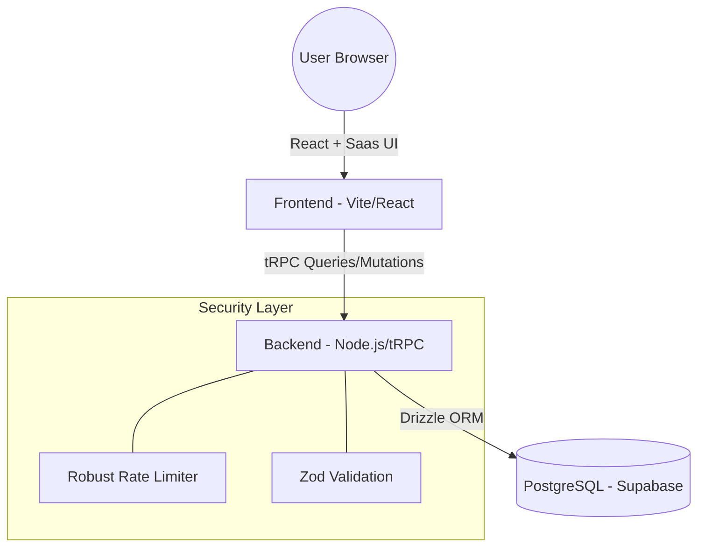

# Clin Solutions L.L.C. Reporting Project

A comprehensive clinical reporting system for Clin Solutions L.L.C. Pharmaceuticals, built with a modern TypeScript stack. This project allows Patients, Health Care Professionals (HCPs), and Family members to submit various clinical and adverse event reports.

## Project Structure

- **`frontend/`**: React + Vite + TypeScript frontend.
  - UI Library: [Saas UI](https://saas-ui.dev/) (built on Chakra UI).
  - State Management: React Query.
  - API Client: tRPC.
- **`backend/`**: Node.js + tRPC backend.
  - ORM: [Drizzle ORM](https://orm.drizzle.team/).
  - Database: PostgreSQL (Supabase).
  - Validation: Zod.

## Quick Start

### 1. Prerequisites

- Node.js >= 20
- A Supabase PostgreSQL database URL.

### 2. Backend Setup

1. Navigate to the backend directory: `cd backend`
2. Install dependencies: `npm install`
3. Create a `.env` file based on `.env.example` and add your `DATABASE_URL`.
4. Run the development server: `npm run dev`

### 3. Frontend Setup

1. Navigate to the frontend directory: `cd frontend`
2. Install dependencies: `npm install`
3. Create a `.env` file and set `VITE_API_URL` to your backend URL (default: `http://localhost:3000`).
4. Run the development server: `npm run dev`

## Project Architecture

The project follows a **Monorepo-lite** structure, separating frontend and backend for independent deployment while sharing Type definitions via tRPC.



## File Structure

```text
clinsol-reporting/
├── frontend/               # React Application
│   ├── src/
│   │   ├── app/            # Main App component & Providers
│   │   ├── features/       # Domain modules (Patient, HCP, Family)
│   │   ├── shared/         # Reusable UI components
│   │   └── utils/          # tRPC client & helper utilities
├── backend/                # Node.js API
│   ├── src/
│   │   ├── db/             # Database schemas & Migration config
│   │   ├── modules/        # API Routers & Business Logic
│   │   ├── trpc/           # tRPC setup & Rate Limit middleware
│   │   └── server.ts       # HTTP Server entry point
│   └── test-rate-limit.ts  # Verification utility
└── README.md               # Root Documentation Documentation
```

## Database Sync

To push your local schema changes to the Supabase database:

```bash
cd backend
npm run db:generate  # Generate migrations
npm run db:migrate   # Apply migrations to the database
# Or use push for prototyping:
npx drizzle-kit push:pg
```

## Security Implementation

- **Input Validation**: Strict Zod schemas ensure no invalid data enters the database.
- **CORS**: Restricted origins in production; permissive in development.
- **Robust Rate Limiting**:
  - Uses **Multi-layer Fingerprinting** (IP + User-Agent + Persistent Guest ID).
  - Prevents "Shared IP" collisions on hospital networks.
  - Generous limits (50/hr) to balance security and usability.
