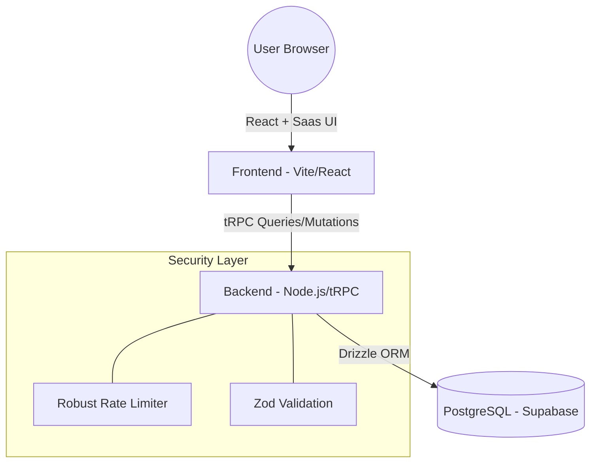
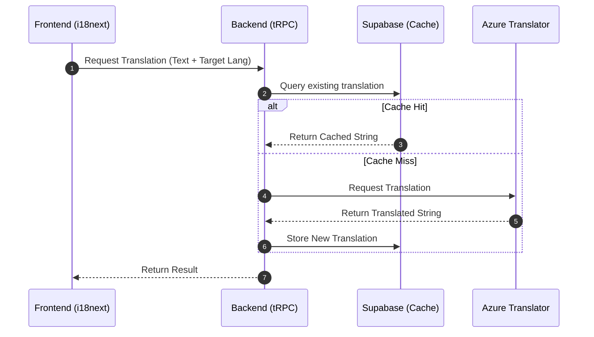

# Clin Solutions L.L.C. Reporting Project

A comprehensive clinical reporting system for Clin Solutions L.L.C. Pharmaceuticals, built with a modern TypeScript stack. This project allows Patients, Health Care Professionals (HCPs), and Family members to submit verified clinical and adverse event reports compliant with E2B R3 standards.

- **`backend/`**: Node.js + tRPC backend.
  - ORM: [Drizzle ORM](https://orm.drizzle.team/).
  - Database: PostgreSQL (Supabase).
  - Compliance: E2B R3 (HL7 v3) XML generation & ICH validation.
  - Translation: Azure Translator API + Supabase Caching.
  - Validation: Zod.
- **`frontend/`**: React + Vite + TypeScript frontend.
  - UI Library: [Saas UI](https://saas-ui.dev/) (built on Chakra UI).
  - Internationalization: [react-i18next](https://react.i18next.com/) supporting 137+ languages.
  - RTL Support: Dynamic Right-to-Left layout for languages like Arabic and Persian.
  - State Management: React Query.
  - API Client: tRPC.

## Key Features

- **E2B R3 Standards**: Automatic generation of US-CLINSOLUTION compliant safety reports in XML format.
- **MedDRA Integration**: Smart autocomplete and mapping to full PT (Preferred Term) and LLT (Lowest Level Term) hierarchies.
- **Improved Symptoms UX**: Dynamic, multi-block symptom entry with clear numbering and visual separation.
- **Audit Logging**: Robust server-side tracking of all safety data exports and modifications.
- **137+ Languages**: Real-time translation with intelligent backend-side caching.

## Quick Start

### 1. Prerequisites

- Node.js >= 20
- A Supabase PostgreSQL database URL.

### 2. Backend Setup

1. Navigate to the backend directory: `cd backend`
2. Install dependencies: `npm install`
3. Create a `.env` file based on `.env.example` and add your `DATABASE_URL`.
4. Run the development server: `npm run dev`

### 3. Frontend Setup

1. Navigate to the frontend directory: `cd frontend`
2. Install dependencies: `npm install`
3. Create a `.env` file and set `VITE_API_URL` to your backend URL (default: `http://localhost:3000`).
4. Run the development server: `npm run dev`

## Project Architecture

The project follows a **Monorepo-lite** structure, separating frontend and backend for independent deployment while sharing Type definitions via tRPC.


```mermaid
graph TD
    User((User Browser)) -->|React + Saas UI| Frontend[Frontend - Vite/React]
    Frontend -->|tRPC Queries/Mutations| Backend[Backend - Node.js/tRPC]
    Backend -->|Drizzle ORM| DB[(PostgreSQL - Supabase)]

    subgraph Security Layer
        Backend --- RL[Robust Rate Limiter]
        Backend --- Zod[Zod Validation]
    end
```

## File Structure

```text
clinsol-reporting/
├── frontend/               # React Application
│   ├── src/
│   │   ├── app/            # Main App component & Providers
│   │   ├── features/       # Domain modules (Patient, HCP, Family)
│   │   ├── shared/         # Reusable UI components
│   │   └── utils/          # tRPC client & helper utilities
├── backend/                # Node.js API
│   ├── src/
│   │   ├── db/             # Database schemas & Migration config
│   │   ├── modules/        # API Routers & Business Logic
│   │   ├── trpc/           # tRPC setup & Rate Limit middleware
│   │   └── server.ts       # HTTP Server entry point
│   └── test-rate-limit.ts  # Verification utility
└── README.md               # Root Documentation Documentation
```

## Database Synchronization

To synchronize your schema changes with the database during development:

```bash
cd backend
# 1. Modify your schema in src/db/*.schema.ts
# 2. Push changes directly to Supabase (Recommended for Dev)
npm run db:push

# 3. Or generate a migration file for tracking history
npm run db:generate
```

## Security & Globalization

### Security Implementation

- **Input Validation**: Strict Zod schemas ensure no invalid data enters the database.
- **CORS**: Restricted origins in production; permissive in development.
- **Robust Rate Limiting**: Multi-layer fingerprinting (IP + User-Agent + Persistent Guest ID) to prevent collisions on shared hospital networks.
- **reCAPTCHA**: Integrated bot protection on final report submission steps.

### Globalization & UX

- **137 Languages**: Full synchronization with Azure Translator for enterprise-grade clinical reporting.
- **RTL Support**: Dynamic directionality (`dir="rtl"`) for scripts like Arabic, Hebrew, and Persian.
- **Responsive Forms**: Optimized stepper and container layouts that handle long-text expansion (e.g., Tamil) and varied screen sizes.
- **Smart Translation Cache**: Backend-side caching of translations in Supabase to minimize Azure API calls.

#### Translation Flow


```mermaid
sequenceDiagram
    autonumber
    participant UI as Frontend (i18next)
    participant API as Backend (tRPC)
    participant DB as Supabase (Cache)
    participant Azure as Azure Translator

    UI->>API: Request Translation (Text + Target Lang)
    API->>DB: Query existing translation

    alt Cache Hit
        DB-->>API: Return Cached String
    else Cache Miss
        API->>Azure: Request Translation
        Azure-->>API: Return Translated String
        API->>DB: Store New Translation
    end

    API-->>UI: Return Result
```
